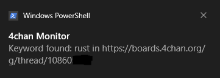
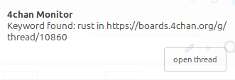

# 4chan-board-monitor

This program sends you a notification upon finding a 4chan thread with the corresponding keyword from the OP.

### Examples: 

Windows:



Linux (Mint):




# Installation

## For Windows
- Download the ZIP file from [Releases](https://github.com/youd810/4chan-board-monitor/releases).
- Extract it somewhere.

Installing the Rust compiler on Windows is painful but if you want to compile the source code yourself:
- Install [Rustup](https://rustup.rs/).
- Download this repo, either with clone `git clone https://github.com/youd810/4chan-board-monitor.git` or manually download the ZIP file.
- Navigate into the root directory of this repo in your terminal and run `cargo build --release`
- You can locate the executable in `target/release`.

## For Linux
- Install the required tools and packages `sudo apt install -y curl build-essential pkg-config libgtk-3-dev libayatana-appindicator3-dev libdbus-1-dev libxdo-dev`.
- Install Rustup `curl --proto '=https' --tlsv1.2 -sSf https://sh.rustup.rs | sh`.
- Download this repo, either with clone `git clone https://github.com/youd810/4chan-board-monitor.git` or manually download the ZIP file.
- Navigate into the root directory of this repo in your terminal and run `cargo build --release`.
- You can locate the executable in `target/release`.

<br>

# Running 

## For Both

### Before Running

- **IMPORTANT**: Make sure `config.toml` is in the same folder as your executables.
- After compiling, copy your `config.toml` file into `target/release`.
- Note: A fallback solution has been added where if you try to run either executable while `config.toml` is nowhere to be found, an defaul one (with /g/ board and no keyword) will be created automatically.

## For Windows
- Run the config.exe FIRST (or edit the config.toml if you want to manually add boards).
- Run monitor.exe (you can tell it's running if you see the icon in the icon tray).
- **Tip**: If you don't want to manually run the executable every time you boot the PC, you can put the executable shortcut in the startup folder by pressing
`WINDOWS + R` then input `shell:startup` as the argument.

## For linux
- Run the config executable FIRST via terminal with `./config` (or edit the config.toml if you want to manually add boards).
- Run the monitor executable (you can tell it's running if you see the icon in the tray).
 
**Tip** : 

For automatic startup upon boot:
- Run this in your terminal.
```
mkdir -p ~/.config/autostart
nano ~/.config/autostart/4chan-monitor.desktop
```
- Then paste this (don't forget to adjust the path):
```
[Desktop Entry]
Type=Application
Name=4chan Monitor
Exec=/path/to/your/monitor-executable
Terminal=false
Hidden=false
NoDisplay=false
X-GNOME-Autostart-enabled=true
```
